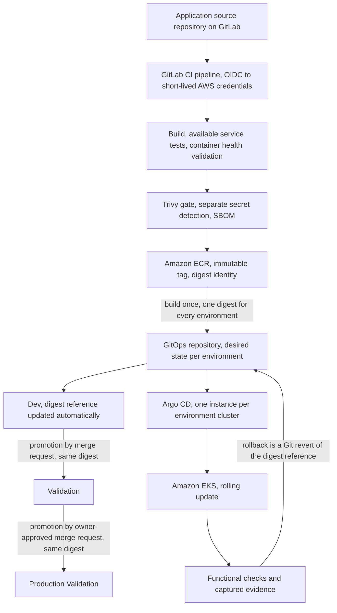

# ADR-0009: Define the software delivery model

## Status

Proposed (2026-07-31)

## Context

The platform now has a runtime and a boundary but no defined path from a
source change to a running workload. Amazon EKS runs one cluster per
active environment, with Validation and Production Validation created
and destroyed on demand (ADR-0006). Nodes and workloads sit in private
subnets behind one managed ingress (ADR-0007). Changes promote in one
declared order, Dev, then Validation, then Production Validation, with
a recorded approval required before the final stage (ADR-0004).
Workload identity and secrets are settled (ADR-0008), and
infrastructure changes stay inside a reviewed Terraform workflow whose
automation is capped at plan-only (ADR-0003).

This record defines how application change moves: source, build,
verification, artifact, promotion, reconciliation, running workload,
evidence. It bundles the stages of that path deliberately. Artifact
identity, promotion, and reconciliation constrain each other so
tightly that separate records would each be incomplete.

Five requirements shape it. Every deployable change must originate in
version control and pass an automated build and validation workflow
that produces a versioned, retained artifact before deployment
(REQ-011). Promotion must follow the declared order with a
recorded approval before the production-like stage (REQ-012). A
release must be progressive, haltable, and reversible through a
documented path (REQ-013). Running artifacts must trace to the source
change and build that produced them, and no secret may appear in code,
images, or repositories (REQ-007). The same artifact must run in every
environment with configuration supplied at runtime, not rebuilt per
environment (REQ-009).

The owner's prior bare-metal platform project proved parts of this
path: GitLab CI pipelines with image scanning gates, registry
publication with digest verification, Helm deployment of owner-built
images, and Argo CD reconciliation with drift correction, proven on a
single canary application. It did not prove fleet-wide CI, promotion
across environments, or rollback. This record designs the full path
deliberately instead of copying a finished system.

## Decision

**Repositories and hosting.** Delivery uses three repositories, each
with one responsibility. An application source repository on
GitLab.com holds workload source, container build definitions, and
per-service CI. A GitOps repository on GitLab.com holds the desired
state of every environment: deployment values, environment
configuration references, and the image digest each environment runs.
This public reference repository on GitHub holds architecture,
decisions, the Terraform infrastructure definitions ADR-0003 places
in it, implementation documentation, and sanitized evidence. GitLab
delivers the application, GitHub presents the platform. The
reconciler trusts only the GitOps repository, so a change to
application code and a change to what runs in an environment are
separate events, independently reviewable from Validation onward.

**Pipeline identity.** CI runs on GitLab CI/CD. Pipelines authenticate
to AWS through OIDC federation: a job exchanges its identity token for
short-lived STS credentials against a dedicated IAM role, scoped to
its purpose and constrained to repository and branch. No long-lived
AWS credential exists in any pipeline. This settles the automation
identity class ADR-0005 left open: humans in Identity Center,
workloads in Pod Identity, automation in federated roles, never
mixed. The delivery pipeline never applies infrastructure change,
which remains inside the ADR-0003 workflow.

**Build and verification.** Images are owner-built from source in the
application repository. Each service has its own pipeline composed
from shared definitions, and only services changed by a commit are
built. A change must pass linting, build, the service-specific tests
it actually has, a container start and health check, and the security
gates below before an artifact exists. Test depth varies across a
polyglot workload and is never overstated: gates assert only what
actually ran.

**Security gates.** One primary scanning platform, Trivy, covers image
and dependency scanning with a blocking gate on fixable HIGH and
CRITICAL findings, and SBOM generation for every published artifact.
The same platform is proposed for the static checks of the ADR-0003
Terraform workflow, a tooling choice inside that record's existing
workflow. Findings without an available fix are reported,
not hidden. Every scanning exception carries a written justification
and an expiry. Secret detection runs separately in the pipeline
because it is a different class of control. Image signing and build
attestations are deferred with a revisit trigger. Until then, digest
identity and the recorded build chain carry provenance.

**Artifact identity.** Amazon ECR is the single registry, one
repository per owned service, managed by Terraform. Tags are
immutable and derived from the source commit. The artifact's identity
is its digest. An image is built exactly once, and every environment
that runs it refers to that same digest. ECR is declared a persistent
shared foundation under ADR-0004's rules: its purpose is artifact
retention across environment lifecycles, its cost is bounded by
lifecycle policies and visible in cost reporting, its lifecycle is
owned by the platform engineer role through Terraform, its recovery
procedure is rebuild from source and will be documented, and its
decommission path is deletion once no environment references its
images. It joins the Terraform state backend as a documented
exception in every zero-resource claim under REQ-019. A shared
registry is a deliberate boundary crossing where a shared controller
is not. Promotion's whole point is that every environment runs the
same artifact, and each environment's pull access is scoped to its
own role, while a shared controller would hold write access into
every cluster.

**Promotion and approval.** Promotion is a Git change to the GitOps
repository, nothing else. A merge to the application repository's
main branch builds, verifies, and publishes the artifact, then
updates the Dev digest reference automatically. Promotion to
Validation is a merge request changing that environment's digest
reference. Promotion to Production Validation is the same kind of
change, approved and merged by the owner. That merge is the recorded
approval ADR-0004 requires, reconstructible from Git history. The
digest never changes between environments. Required evidence is
captured at each gate, and always before an ephemeral environment is
destroyed.

**Deployment definition.** The workload selection itself remains a
separate, future record, and the charter's open question of an
existing workload versus a purpose-built one stays open. Whatever is
selected, environments are described by a Helm chart plus
owner-controlled values layering: a base layer that keeps any bundled
observability disabled, an environment layer, and an image layer
pinning each service to its immutable digest. If the selected
workload ships an upstream chart, that chart is used and not forked.
If the chart cannot express a required configuration or preserve
digest identity for every service, forking becomes the recorded
fallback. A purpose-built workload would use an owner-authored chart
under the same layering.

**Reconciliation.** Each environment cluster runs its own Argo CD
instance under the version-pinning and controlled-upgrade rules of
ADR-0006, pulling from the GitOps repository. Reconciliation is
continuous and separate from promotion: promotion changes what should
run, reconciliation makes the cluster match it and corrects drift.
Pull-based delivery fits the private-node network model, since
nothing outside a cluster pushes into it. Argo CD owns
synchronization and drift correction only. It does not own
infrastructure, cluster lifecycle, image builds, promotion decisions,
secret values, or approvals. Because Validation and Production
Validation clusters are ephemeral, their Argo CD instances bootstrap
from version-controlled definitions and hold no state that Git does
not. This topology follows from the environment isolation already
decided, and it remains unproven until the first ephemeral
environment exercise demonstrates bootstrap through reconciliation.
That demonstration is a required validation, and the topology is a
named revisit trigger.

**Release and rollback.** Within an environment, releases use
Kubernetes rolling updates: progressive by replacement, haltable
mid-rollout, and reversible. Rolling back an application is a Git
revert of its digest reference, reconciled like any other change.
Helm's own rollback machinery is not used, Git history is the
rollback mechanism. Infrastructure rollback stays inside the
Terraform workflow, and data rollback belongs to the future backup
and recovery decision. A rolled-back version must tolerate the
current data schema, or the manual path is documented. One validated
rollback exercise is required before implementation of this record is
considered complete, matching the rotation exercise ADR-0008
requires. A dedicated progressive delivery controller is deferred.
Rolling replacement does not satisfy REQ-008's criterion that
requests be directed to a chosen version during a release. That
capability arrives with the deferred controller, and until then its
absence is recorded rather than claimed.

**Traceability and evidence.** Every running workload traces back
through one chain: source commit, pipeline run, image tag, digest,
GitOps reference, reconciliation revision, running container image
identifier. The minimum evidence for a delivery claim: the pipeline
run, test and scan results, the SBOM, the digest, the registry entry,
the desired-state change, the reconciliation record, the runtime
identifier match, functional validation, and, for the final stage,
the browser-reachable check ADR-0007 requires.

## Delivery Flow

The decision prose above is the authoritative reading of this flow.

## Considered Options

| Option | Assessment | Outcome |
|---|---|---|
| GitLab.com with GitLab CI/CD | Deepens a delivery toolchain the owner already runs professionally and proved in the prior project, hosted runners, native OIDC to AWS | Selected |
| GitHub Actions | Equivalent OIDC federation and hosted runners, but splits delivery practice across a second CI ecosystem and gives the public reference platform a second responsibility | Rejected |
| Self-managed GitLab | Full control, but adds a billable service to run, patch, back up, and keep reachable, none of which this platform exists to prove | Rejected |
| GitLab Container Registry as runtime registry | Adds a third-party availability dependency to every pod start and needs pull secrets, where ECR shares the account's existing egress path and node-native access | Rejected |
| Docker Hub as runtime registry | Used in the prior project, but rate limits and a credential surface outside the account | Rejected |
| Push-based deployment from CI | CI would hold credentials into every private cluster and desired state would live in pipeline state instead of Git | Rejected |
| One central Argo CD for all environments | One installation, but it would cross the environment boundaries ADR-0004 and ADR-0007 establish and has no persistent home in this topology | Rejected |
| Forking the workload chart | Full control at the price of carrying upstream maintenance without a present need | Fallback with trigger |
| Raw manifests per service | Explicit, but duplicates configuration across every service and environment | Rejected |
| Progressive delivery controller now | Traffic-split releases before any requirement demands them, another controller to operate | Deferred |
| Image signing and attestations now | Provenance signatures without a consumer that verifies them | Deferred |

## Rationale

The substance of this model is its boundaries, not its tools.
Application source, artifact production, desired state, runtime
reconciliation, and evidence are separate responsibilities: they
change at different rates, fail differently, and answer to different
controls. Every tool named in this record could be replaced without
moving those boundaries, which is what keeps the implementation
replaceable.

The delivery platform choice is about depth, not capability. On
identity federation and hosted runners the credible platforms are
equivalent, as the options above record. What decides it is that the
owner's delivery practice, professionally and in the prior project's
validated pipelines, is GitLab, and depth compounds where practice
already lives.

Digest identity exists because a rebuild is a different artifact. The
scan results, health checks, and functional validation that passed
belong to one binary image. Rebuilding per environment would discard
that assurance and reintroduce the gap REQ-009 closes. Build once,
refer by digest everywhere, and promotion becomes a statement about
an artifact that has already passed its gates.

Promotion as a Git change collapses three systems into one. The
approval record, the audit trail, and the rollback mechanism are all
properties Git already has. A separate deployment tool with its own
approval state would add a second source of truth exactly where the
architecture needs one. The same reasoning keeps reconciliation
separate: a reconciler with opinions would be a second
decision-maker, and the model needs exactly one, Git.

Per-cluster Argo CD is the topology the existing architecture forces.
Environments are isolated by account design, network, and lifecycle.
A central controller would be the single control-plane component
holding write access across those boundaries, and the only
persistent cluster, Dev, is the wrong home for the component that
deploys Production Validation. The cost
is bootstrap per environment, accepted because desired state lives in
Git and a fresh instance converges from nothing.

Rolling updates are the honest baseline for REQ-013. They progress
replica by replica, halt on demand, and reverse through Git revert. A
progressive delivery controller would add traffic-split releases and
automated analysis, capabilities nothing yet requires, at the price
of another controller to operate and prove. The deferral is recorded
with its trigger rather than adopted ahead of need.

In a production organization this model would differ in stated ways:
approvals would span multiple people instead of demonstrating a
recorded control, artifact signatures would be verified at admission,
runners and registries would be sized and made highly available, and
compute limits would be a budget line instead of a free tier. Those
differences are assumptions recorded here, not claims about this
platform.

## Consequences

Gained: one reviewable path from commit to running workload, an
artifact identity that survives promotion untouched, approval and
rollback as Git properties, delivery that keeps working against
ephemeral environments, per-environment reconciliation that respects
isolation, and a scanning posture with one primary platform and
written exceptions.

Paid for: two hosting platforms to keep credentialed and bounded, a
delivery dependency on GitLab.com availability for changes though not
for running workloads, image pulls that still traverse the ADR-0007
egress path or a separately justified interface endpoint, GitLab.com
free-tier compute limits that changed-service builds and caching must
respect with paid compute as the recorded escape, an Argo CD
bootstrap per environment, a standing ECR storage cost bounded by
lifecycle policies, and
single-owner approvals that demonstrate the control without
organizational separation of duties, as the system context already
records.

The trade is deliberate. The model favors explainability,
reproducibility, and traceability over the smallest possible number
of repositories and platforms.

## Deferred Decisions

This record leaves open, for later decision records or approved
implementation planning: pipeline definitions and job layout, IAM
policies and role names, the ECR repository list and lifecycle rules,
chart version pins, values file layout, the Argo CD installation
method and application layout, the GitOps repository layout, rollout
parameters, scanning thresholds and report retention, the secret
synchronization mechanism ADR-0008 defers, the workload selection
with its service scope and any upstream image exceptions, the
documented application onboarding path REQ-013 also requires,
multi-architecture builds, and signing and attestation tooling.

## Revisit Triggers

Revisit this decision if the selected chart cannot express a required
configuration or preserve digest identity for every service, if
validation demands traffic-split releases, automated release
analysis, or REQ-008's version-directed routing evidence, if the
first ephemeral environment exercise shows the per-cluster Argo CD
bootstrap failing its cost or reliability expectations, if artifacts
gain an external consumer that must verify
provenance, if free-tier compute limits materially constrain
delivery, or if GitLab.com availability materially affects the
ability to change the platform.
