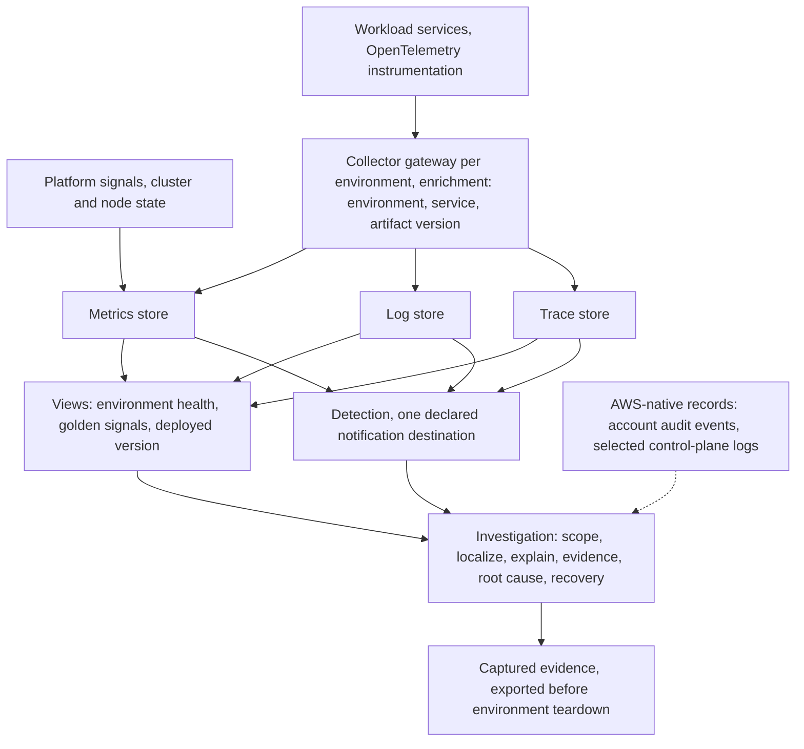

# ADR-0010: Define the observability model

## Status

Accepted (2026-07-31)

## Context

The platform can now change software under control but cannot yet be
understood while it runs. Amazon EKS runs one cluster per active
environment, with Validation and Production Validation created and
destroyed on demand (ADR-0006). Delivery moves immutable artifacts by
digest through Git-recorded promotion, and every running workload
traces back to a source commit (ADR-0009). What is missing is the
other direction: given a running platform, an engineer must be able
to see its state, detect failure, investigate it, and prove what
happened. This record defines that capability.

Two requirements shape it. Metrics, logs, and traces must be
collected from the platform and its workloads and be inspectable
through operational views, with a documented retention window, and
the deployed version and health of a workload must be identifiable
from those views (REQ-014). Signals from platform and workloads must
be correlatable so one problem can be followed across that boundary,
and defined conditions must raise alerts that reach an engineer with
enough context to act on (REQ-015). The logical architecture already
fixes the ownership: the observability group owns telemetry intake,
retention, views, correlation, detection, and alert routing, along
with capturing audit-relevant records, while response procedures
belong to platform operations and the definition of a healthy
workload belongs to the runtime. This record decides how that
ownership is exercised. It bundles the signal model, collection,
correlation, and detection deliberately, because a signal that
cannot be correlated cannot be investigated, and a detection without
investigation context is noise.

The owner's prior bare-metal platform project proved the collection
half of this problem: metrics, logs, and traces collected, stored,
and queried through a collector gateway, including distributed
traces across a many-service workload. It never built alerting or
purposeful dashboards, never proved retention deletion, and left an
attribution defect in which telemetry lost its Kubernetes identity
across collection hops. Those results enter this record as evidence
and lessons only. That project is not a prerequisite: everything
this record requires can be reproduced from this repository alone.

## Decision

**Boundary.** Applications emit telemetry through OpenTelemetry
instrumentation and know exactly one telemetry endpoint. The
platform receives, enriches, routes, stores, correlates, presents,
and detects. Platform operations owns response procedures and the
content of first diagnostic steps. No single component spans the
application, platform, and operations boundaries.

**Topology and lifecycle.** Each environment runs its own in-cluster
observability stack, created with the environment and destroyed with
it. The stack is part of the environment definition, so recreating
an ephemeral environment recreates its observability, and required
evidence is captured before any teardown (ADR-0004). The stack's
components run under the version-pinning and controlled-upgrade
rules of ADR-0006, and any of them that needs AWS access uses Pod
Identity under ADR-0008. The views are reached through the
operator's access path, never through a second public entry, and
the workload-to-gateway ingest path is governed by the layered
network controls of ADR-0007, with exact mechanisms deferred.
Account-level audit events and selected EKS control-plane logs
remain in their AWS-native services, in their default or
environment-scoped forms. This record creates no persistent audit
resource. If a retained audit trail is ever configured, it arrives
as a separately gated persistent shared foundation under ADR-0004's
rules. Neither side ingests the other's signals, so no signal is
stored twice. No observability service outlives its environment.

**Signal model.** Metrics, logs, and traces are all first-class,
which means collected, queryable, correlated, and retained under a
documented policy. Three exist because they answer different
questions and cost differently. Metrics aggregate well and stay
cheap to retain, so they show that behavior changed and when, but
never which request or why. Logs hold the detail an engineer
actually reads, at a volume that grows with traffic rather than
with the number of things measured. Traces are the only signal that
crosses a service boundary as one object, which is what makes them
the instrument for locating a fault in a distributed call path.
Dropping one does not simplify the model, it removes an answer the
other two cannot give. The platform contributes cluster, node, and
workload-state metrics and control-plane logs. Workloads contribute
application metrics, structured logs, and traces. Signal depth
varies by service and is recorded honestly rather than smoothed
over. Uniform instrumentation depth is not claimed.

**Correlation contract.** Every signal carries the environment, the
service, and the deployed artifact version, which is the digest
ADR-0009 promotes. Logs carry the trace identifier wherever trace
context exists. This extends the delivery chain into runtime: source
commit, pipeline run, digest, GitOps revision, running workload,
telemetry, investigation evidence. An incident is traceable to a
commit through signals alone. Exact attribute names are deferred,
attribute quality is owned by the platform at the collection
gateway, and attributes live under a cardinality budget.

**Collection.** One OpenTelemetry Collector gateway per environment
is the only entry point for workload telemetry. Applications never
export directly to a backend. Enrichment happens at the gateway,
which is where environment, Kubernetes identity, and artifact
version are attached. A node-level agent tier is not introduced
until a need is proven. The gateway is a failure boundary: if it is
down, telemetry is lost for that window and workloads are unaffected,
and that loss behavior is characterized honestly rather than
assumed away. Proving that Kubernetes identity survives the full
collection path on EKS is a required validation, because the prior
project lost exactly that attribution.

**Views.** Three operational views exist because three operational
questions exist: environment health, workload golden signals, and
the deployed-version view that shows which digest runs where. Every
view answers a stated question and is referenced from an operating
procedure. Default dashboard imports without an owner and a question
are rejected.

**Detection and alerting.** The alert set is small, curated, and
symptom-first. Every alert states what it means and its first
diagnostic step, with the step's content owned by platform
operations. Conditions for missing telemetry alert as well, because
a silent pipeline is not a healthy one. Alerts route to one declared
notification destination, whose product is deferred. No escalation
chain exists, because one operator runs this platform. That is
recorded as a difference from production organizations, not hidden.

**Investigation doctrine.** Incidents enter through many doors: an
alert, a user report, a failed deployment, a pod state, an anomaly
noticed in a view. Whatever the door, the investigation follows one
structure. Establish scope, meaning what is running and which
version. Localize, using traces for distributed faults and workload
state for crash-class faults, because a process that never started
emits no span. Explain, using logs in the context found. Capture
evidence as the investigation proceeds. Conclude root cause. Verify
recovery. This doctrine gives structure without
pretending every incident follows one path, and it is not an
incident-response process, which belongs to a later operations
record.

**Evidence.** Observability is where the platform's runtime claims
get their proof: health and version snapshots, alert behavior,
investigation trails, and recovery verification, all captured before
an ephemeral environment is destroyed. One validated investigation
exercise, following a deliberately induced fault from alert through
root cause to verified recovery, is required before implementation
of this record is considered complete. It joins the rotation
exercise of ADR-0008 and the rollback exercise of ADR-0009 as the
platform's third standing proof. The destination that holds
exported evidence is deferred.

**Cost bounds.** Retention windows are short and documented, and
deletion at the end of a window must be provable, because the prior
project never proved it. Attribute cardinality lives under a budget.
Sampling exists as a future cost lever and starts simple. Storage is
small and bounded. The stack runs on existing node capacity, sized
during implementation with trace-store memory pressure recorded as
a known risk. Any persistent audit-trail configuration is a
separately gated cost decision.

**Tooling.** The architecture lands on a coherent minimum. The
OpenTelemetry Collector is the gateway. Prometheus and Grafana carry
metrics and views. Logs land in a Loki-class store, with Loki the
candidate carried from prior experience. Traces land in Jaeger or
Tempo, and that single choice is made during implementation
planning against recorded evidence, because the deciding property,
the real quality of trace-to-log correlation in the view layer on
EKS, can only be measured, not argued. No SLO tooling is adopted,
because no service commitment exists to measure.

## Signal Flow

The decision prose above is the authoritative reading of this flow.

## Considered Options

| Option | Assessment | Outcome |
|---|---|---|
| In-cluster stack per environment | Follows environment isolation and lifecycle, no persistent foundation beyond existing node capacity, stack recreation proves reproducibility | Selected |
| AWS managed observability services | Data survives teardown and operations shrink, but standing ingestion and user costs, and correlation splits across vendor models | Rejected |
| Central observability cluster | One stack for all environments, but a new persistent foundation that crosses the environment boundaries ADR-0004 establishes | Rejected |
| Applications exporting directly to backends | Removes the gateway, but scatters enrichment and backend knowledge into every service | Rejected |
| Node-agent collection tier now | Standard at scale, but adds capacity and management before any requirement demands it | Deferred |
| Mandatory uniform telemetry depth per service | Reads well, but claims signal quality that does not exist across a polyglot workload | Rejected |
| Default dashboard imports | Fast visual coverage, but views without operational questions are decoration | Rejected |
| SLO and burn-rate alerting now | Disciplined at scale, but no service commitment exists here to measure | Deferred |
| Re-ingesting AWS-native logs into the stack | One pane of glass, but duplicate storage and duplicate cost for records AWS already holds | Rejected |
| Selecting the trace backend now | Would close the stack, but the deciding correlation evidence does not exist yet | Deferred to implementation evidence |

## Rationale

Topology follows lifecycle. Validation and Production Validation
environments are born and destroyed as a feature of the
architecture, and a monitoring system that
outlives what it observes becomes a standing cost holding data
nobody is required to keep. Putting the stack inside the environment
makes observability part of what an environment rebuild proves, and
it keeps the isolation the platform has already paid for.

The correlation contract is the actual architecture. Three excellent
stores without shared identity are three silos, and investigation
across silos is archaeology. The contract is deliberately small,
environment, service, and artifact version, because those three
answer the first questions of every incident: where, what, and which
release. Carrying the delivery digest as the version key means the
observability system and the delivery system agree about what is
running, which is what makes an incident traceable to a commit.

The gateway earns its place as a policy point, not plumbing. Drop
rules, enrichment, routing, and attribute quality live in one
platform-owned component, so applications stay decoupled from
backends and the platform can change stores without touching a
service. The cost is a failure boundary, accepted because losing
telemetry for a window is recoverable and losing enrichment
discipline is not.

Alerting is sparse by design. An alert here is a claim that
something needs an operator, carrying its own meaning and first
step. A set that grows by reflex trains its operator to ignore it,
which is worse than no alerting, because it looks like coverage.
Missing-data conditions alert precisely because a silent pipeline
reads as a healthy one until something is missed. The set grows
from incidents, not from imagination.

Leaving the trace backend open is honesty, not indecision. Both
candidates satisfy the architecture. They differ in a property this
project has never measured, how well traces link to logs in the view
layer under this contract, and the record refuses to settle by
preference what implementation can settle by evidence.

In a production organization this model would differ in stated
ways: service commitments would exist and be measured, alerting
would page a rotation through an escalation chain, retention would
be long and tiered, collectors would be highly available, and views
would serve many teams. Those differences are recorded as
assumptions, not as claims about this platform.

## Consequences

Gained: a platform that can be understood while running, signals
that share one identity with the delivery chain, views bound to
operational questions, alerts that carry their own next step, an
investigation doctrine that produces evidence as it runs, and a
third standing exercise that proves detection and investigation
instead of asserting them.

Paid for: an observability stack consuming node capacity in every
environment, telemetry that dies with its environment once evidence
is captured, self-operated components with their own upgrade and
sizing duties, an alert set that starts sparse and may miss failure
modes until incidents grow it, and one stack decision deliberately
left open until implementation produces the evidence to close it.
The model spends its complexity budget on correlation and honesty
rather than on tool count.

## Deferred Decisions

This record leaves open, for later decision records or approved
implementation planning: exact attribute names, retention numbers,
sampling ratios, chart and version pins, storage sizes, collector
replica and queue configuration, the log collection mechanism, the
trace backend selection, alert rules and severities, dashboard
definitions, the notification product, control-plane log type
selection, persistent audit-trail configuration, a node-agent tier,
exemplar support, and any service-level objective work.

## Revisit Triggers

Revisit this decision if operating the in-cluster stack costs more
attention than it returns, if a requirement appears for
cross-environment or long-term telemetry, if service-level
commitments make SLO measurement real, if Kubernetes identity
cannot be proven across the collection path on EKS despite the
required validation, if the alert set grows past what one operator
can genuinely own, if collector loss windows prove unacceptable for
evidence capture, or if audit needs outgrow the AWS-native records.
