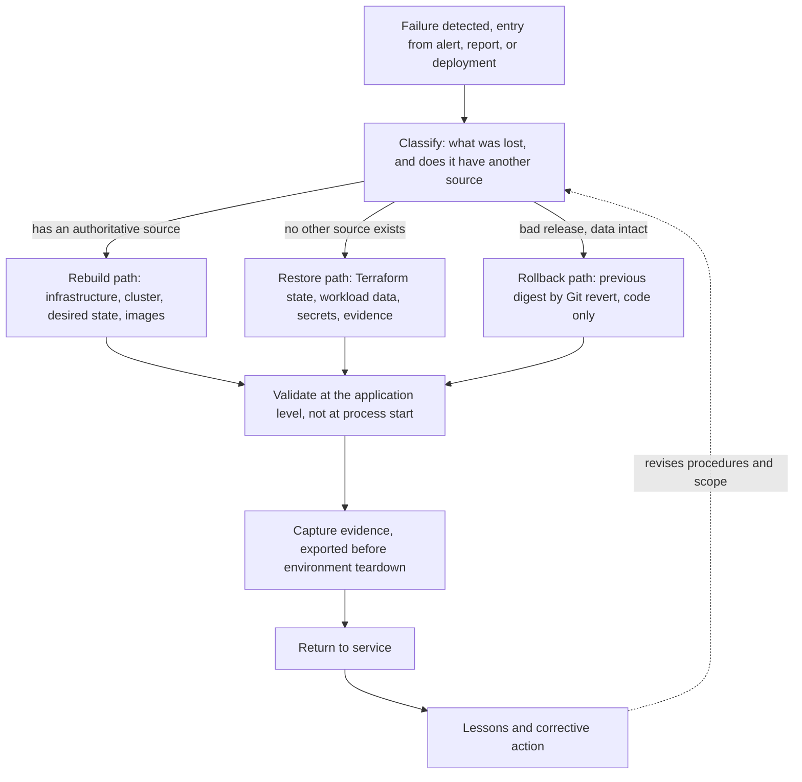

# ADR-0011: Define the backup and recovery model

## Status

Proposed (2026-07-31)

## Context

The platform can now be defined, delivered to, and observed, but it has
no stated answer to loss. Infrastructure is declared in Terraform with
per-environment remote state (ADR-0003). Environments are one dedicated
account with a persistent Dev and ephemeral Validation and Production
Validation (ADR-0004), running one EKS cluster each (ADR-0006).
Delivery promotes immutable artifacts by digest through Git-recorded
changes (ADR-0009), and observability verifies recovery and exports
evidence before an environment is destroyed (ADR-0010). What is
missing is the decision about what happens when something is gone.

Three requirements shape this record. State designated as worth
keeping must be backed up and restorable, and at least one meaningful
failure scenario must have a documented recovery procedure that has
been deliberately exercised, with the exercise recording what failed,
what was done, and how long it took (REQ-016). Any environment or set
of billable resources must be removable through a documented teardown
procedure, and its billable resources must be absent afterward
(REQ-004). The platform must be recreatable from the repository and
its documented prerequisites alone (REQ-001).

The logical architecture places ownership with Recovery and
Continuity: the designation of state worth keeping, backup scope,
restore procedures, exercised failure scenarios, and recovery
evidence. Recovery is executed through the infrastructure group's
controlled channel, and the runtime participates where application
state is involved, but accountability for the outcome stays with
Recovery and Continuity. The capability model sets the ambition
plainly: prove that recovery works for what matters, rather than
claim the platform survives everything.

The owner's prior bare-metal platform project contributes evidence and
lessons only. It proved isolated-target restores of a self-managed
control plane and of application data, and it recorded honestly that
its own volume-recovery drill was never run, its teardown ordering was
never drilled, and its retention deletion was never proven. Those are
inputs to this design, not a prerequisite for it. Every exercise this
record requires is reproducible from this repository and its
documented prerequisites alone.

## Decision

**Vocabulary.** Three distinctions carry this record and are to be
used consistently across the repository. Backup is a copy taken so
something can be restored, and it is unproven until a restore has
actually run. Rebuild recreates a thing from its authoritative
source, while restore returns a copy of something that had no other
source. Rollback returns to a previous version of code or
configuration, and it never returns data. Conflating any of these
three pairs is how recovery plans become fiction.

**Recovery model.** Rebuild first. Anything that can be recreated
from an authoritative source is recreated, not restored. Backup
exists only for what has no other source. This is not austerity, it
is the consequence of decisions already made: infrastructure lives in
Terraform, cluster contents live in Git, artifacts live in a registry
and can be rebuilt from source, and secrets live outside the cluster.
The small backup surface is an outcome of that architecture, and
keeping it small is a design goal.

**Designated recoverable state.** Four items are designated as worth
keeping, which makes them the scope of backup and restore obligations:
Terraform state, workload persistent data, the contents of the secret
store, and exported evidence. Everything else is rebuild-only. That
includes networks, clusters, node groups, workloads, desired state,
container images, and per-environment observability stacks. Declaring
those rebuild-only is a decision with a stated reason, not an
omission.

**Failure scope.** The model covers workload and pod failure, node
failure, failed deployments, cluster loss, environment loss, loss of
any designated state, and recovery of account-level configuration
where it is expressed in Terraform. Region-level disaster recovery is
out of scope, matching the project charter, and is recorded here as a
limitation rather than left unstated. The revisit trigger is below.
Each scope has one owner: the runtime replaces failed pods and nodes,
delivery reverses failed deployments, and this record owns everything
from cluster loss down to designated state loss and account-level
configuration expressed in Terraform.

**Infrastructure and Terraform state.** Terraform recreates every
environment-scoped resource, so infrastructure loss is a rebuild.
State is different. It is the only control asset with no other
source, and losing it leaves infrastructure running, unmanaged, and
still billing. ADR-0003 already requires a versioned backend with
locking, restricted access, and a defined recovery path. This record
does not redesign that. It commits to writing the path down and
proving it: version rollback answers corruption, version restore
answers loss, and resource import is recorded as the last resort
rather than the plan. Because the backend is excluded from normal
environment destruction, its own protection and decommission stay
outside any environment teardown.

**Clusters and desired state.** EKS runs an AWS-managed control
plane. There is no operator-accessible etcd, no snapshot command, and
therefore no control-plane backup obligation. This is the single
largest difference from self-managed Kubernetes and it is stated
explicitly so no one carries the wrong model forward. A cluster is
recovered by recreating it from version-controlled definitions, which
ADR-0006 already established, and its contents return through GitOps
reconciliation. Git is the desired-state record, so desired state
needs no separate backup, and a reconciler holds nothing that Git
does not. Recovery therefore depends on the availability of the
source repositories, which is a stated dependency, mitigated by every
clone being a complete copy of history.

**Application recovery.** Reversing a bad release is a Git revert of
the digest reference reconciled onto the cluster (ADR-0009). That
restores code and configuration and touches no data. Where a
rolled-back version cannot tolerate the current data schema, rollback
alone is insufficient and a documented procedure covering the data
path is required. Application rollback never implies data rollback,
and no document in this repository may imply otherwise.

**Persistent data.** The reference workload and its data model are not
settled and belong to a later record, so no database or storage
product is chosen here. The rule is set instead. Data that must
outlive its environment belongs in a durable managed service with a
native backup and recovery capability. In-cluster storage is
permitted only for data that is regenerable or disposable, unless a
later record justifies otherwise with its own recovery obligation.
Seed and migration steps are written to be repeatable, because
repeatable initialization is the cheapest recoverability there is.

**Secrets and configuration.** The secret store sits outside the
cluster and survives environment teardown (ADR-0008), so its exposure
is not loss on teardown but accidental deletion and compromise.
Deletion is answered by the store's recovery window and compromise by
rotation, whose capability is already mandatory. Non-sensitive
configuration must be declared in Terraform, which is what keeps it a
rebuild rather than designated state. No secret value is ever written
to a repository or to a backup artifact.
A restore also needs the material that decrypts or configures what it
restores, and that material travels a different path from the data,
so it carries its own integrity check.

**Evidence and durable destinations.** Evidence captured before an
ephemeral environment is destroyed must leave that environment, which
answers where the evidence ADR-0010 defers has to live, though the
destination itself remains an implementation decision. Exported
evidence and any backup artifact that must survive teardown live in a
durable destination outside the environment. Every such destination
is a persistent shared foundation under ADR-0004, carrying a
documented purpose, a lifecycle owner, bounded and visible cost, a
recovery path, and a separate decommission procedure, and each joins
the Terraform state backend and the artifact registry as a documented
exception in every zero-resource claim under REQ-019. Products,
layouts, retention numbers, and key structures are implementation
decisions.
Losing evidence does not impair the platform's recovery, but it
destroys the project's ability to support its claims, which is why
evidence is designated state.

**Measured recovery targets.** No service commitment exists here, so
recovery time and data-loss exposure are measured observations, not
promises. Each exercise records the elapsed time with an explicit
basis, and an observation ceiling is never reported as a measured
duration. For ephemeral environments, recovery time is recreation
time, because there is no separate restore path. Data-loss exposure
is meaningful only where a backup actually exists.

**Required exercises.** One Terraform-state recovery exercise is
mandatory before implementation of this record is considered
complete, joining the rotation exercise of ADR-0008, the rollback
exercise of ADR-0009, and the investigation exercise of ADR-0010 as
the platform's fourth standing proof. Teardown and the absence of
orphaned billable resources are proven separately under REQ-004. A
workload-data restore exercise becomes mandatory once the data model
is settled. The remaining two designated items are verified rather
than exercised: a secret is retrieved from the store after a
simulated accidental deletion, and exported evidence is read back
from its destination after an environment is destroyed. Restores are
performed against an isolated target, never over live data, validated
at the application level rather than at process start, and each
exercise record states what it did not exercise.

**Cost and lifecycle.** Keeping the backup surface small is the
primary cost control. The state backend is already an approved
foundation under ADR-0003, so no new cost arrives from it here. At
most two new billable additions come from this record, a durable
destination for evidence and backup artifacts and, later, managed
backup for workload data, and both enter as persistent shared
foundations with separate cost approval. Exercises consume temporary
resources, which is part of their cost and is torn down with them.

## Recovery Flow

The decision prose above is the authoritative reading of this flow.

## Considered Options

| Option | Assessment | Outcome |
|---|---|---|
| Rebuild first, restore only what has no other source | Small backup surface follows from decisions already made, and every rebuild path is exercised by normal environment lifecycle | Selected |
| Back up broadly across the platform | Feels safer, but most of it duplicates sources that already exist and adds cost and restore paths nobody exercises | Rejected |
| Control-plane state backup | Meaningful on self-managed Kubernetes, but EKS exposes no control-plane state to back up | Not applicable |
| Cluster-level backup tooling now | Standard where clusters hold irreplaceable state, but here desired state is in Git and durable data belongs to managed services | Deferred |
| In-cluster storage for data that must outlive its environment | Simpler to deploy, but ties durable data to the least durable layer and to a recovery path this record would then owe | Rejected, reopenable only by a later record carrying its own recovery obligation |
| Treating application rollback as data recovery | Convenient framing, and false, since a version change does not move data | Rejected |
| RTO and RPO as committed targets | Reads authoritative, but no service commitment exists to hold them to | Rejected |
| Evidence retained inside the environment | Simplest placement, but the environment is destroyed on purpose | Rejected |
| Multi-region disaster recovery | Real protection against a scope this platform has excluded, at a cost and complexity the charter rules out | Deferred, out of scope |

## Rationale

The backup surface is small because earlier decisions made almost
everything reproducible. What remains without a source is short: the
state file that describes what was built, the data an application
accumulates, the secrets themselves, and the evidence of what was
proven. Designating exactly those four is not a narrow scope, it is
the honest answer to what cannot be recreated.

Terraform state deserves its place first because it is the only
control asset whose loss is silent. Nothing stops running, no alert
necessarily fires, and the platform simply becomes unmanaged while it
keeps billing. Every other loss announces itself. That asymmetry is
why the mandatory exercise targets state rather than something more
visible.

The managed control plane changes who is responsible, not just how.
On a self-managed cluster an operator owns control-plane state and
must prove they can restore it. On EKS that obligation moves to the
provider, and the operator's obligation becomes the ability to
recreate a cluster and reconcile its contents. Carrying a
control-plane backup requirement into this architecture would be
solving a problem that the platform does not have, and would obscure
the one it does: whether the definitions are complete enough to
rebuild from.

Exercises exist because a backup that has never been restored is a
hypothesis. The requirement is not a schedule of drills, it is the
principle that any recovery claim in this repository is backed by a
recorded exercise, including what was not exercised. That last part
matters as much as the result, because an untested boundary silently
reads as coverage.

In a production organization this model would differ in stated ways:
recovery objectives would be commitments with consequences, region
loss would be designed for rather than excluded, backup and restore
would run on a schedule with monitoring of their own, and data
recovery would have named owners separate from the platform team.
Those are recorded assumptions, not claims about this platform.

## Consequences

Gained: a recovery model with a short, defensible scope, vocabulary
that keeps rollback from being mistaken for recovery, one clearly
identified irreplaceable control asset, a data rule that holds before
the workload is chosen, a settled home for evidence, and a fourth
standing exercise that proves recovery rather than asserting it.

Paid for: two potential new persistent foundations with their own
cost and lifecycle duties, a dependency on hosted source repositories
that is stated rather than hidden, no protection against region loss,
recovery times that are observed rather than guaranteed, and a data
restore obligation that cannot be discharged until the workload's
data model is settled.

## Deferred Decisions

This record leaves open, for later decision records or approved
implementation planning: backup tooling and snapshot mechanisms,
retention periods and schedules, the durable destination's product
and layout, key management structure, the secret store's recovery
window length, the workload data model and its backup capability,
recovery-time and data-loss expectations expressed as numbers, the
detailed state-import procedure, and exercise cadence.

## Revisit Triggers

Revisit this decision if the workload requires durable data that
cannot be placed in a managed service, if a requirement appears that
justifies region-level disaster recovery, if the mandatory
state-recovery exercise fails or proves the documented path
inadequate, if teardown proof finds orphaned billable resources, if
evidence volume outgrows its lifecycle bounds, or if dependence on
hosted source repositories proves unacceptable for recovery.
