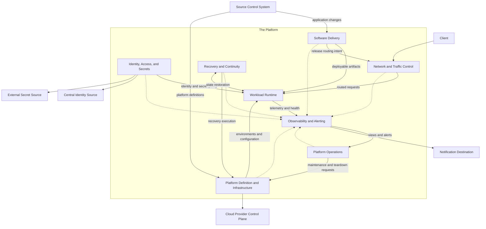

# Logical Architecture

## Purpose

The [System Context](system-context.md) draws a single boundary around the platform and deliberately stops there. This document opens that boundary: it decomposes the platform into eight technology-neutral responsibility groups, states what each group owns and does not own, and shows how the groups interact to satisfy the [Requirements Baseline](requirements-baseline.md). It assigns responsibility and nothing else. Every technology that implements a group was selected in its own decision record, and the closing section maps each area to the record that settled it.

## Decomposition Rules

The [Project Charter](project-charter.md) governs the project; these rules govern only this decomposition.

- A logical group is a responsibility and control boundary, not a product or a deployment unit.
- Every group owns at least one approved requirement. A group that owns none has no reason to exist.
- Every requirement has exactly one primary owning group. Supporting groups participate through declared interfaces; they never become second owners.
- Capability ownership, not hosting location, decides what belongs to a group; the System Context applies the same rule to the platform boundary itself.
- Capability domains and logical groups are different views of one platform; the model below records how they relate.
- Automation is not a logical group: it executes approved decisions inside the group that owns them.

## Logical Responsibility Model

| # | Logical Group | Purpose | Primary Requirements |
|---|---|---|---|
| 1 | Platform Definition and Infrastructure | Holds the platform's versioned intent and turns it into real, controlled, removable infrastructure | REQ-001 to REQ-004 |
| 2 | Identity, Access, and Secrets | Decides who and what may act, and how secrets reach running workloads | REQ-005 to REQ-007 |
| 3 | Network and Traffic Control | Makes every path into, out of, and across the platform deliberate | REQ-008 |
| 4 | Workload Runtime | Runs container workloads and keeps them running | REQ-009, REQ-010 |
| 5 | Software Delivery | Moves change from source to the production-like stage under control | REQ-011 to REQ-013 |
| 6 | Observability and Alerting | Collects and correlates signals, detects conditions, raises alerts | REQ-014, REQ-015 |
| 7 | Recovery and Continuity | Proves that what matters can be restored | REQ-016 |
| 8 | Platform Operations | Keeps the established platform operable, maintained, and worth its cost | REQ-017 to REQ-019 |

The [capability model](capability-model.md)'s ten domains and these eight groups are two views of the same platform, and both stay in force. Domains describe areas of behavior; groups describe who is responsible for that behavior, and along which lifecycle and trust boundaries. Most domains map one-to-one; two regroupings are deliberate. Platform Foundation and Infrastructure share one group because the platform's definitions and the machinery that applies them share an owner, a lifecycle, and every future technology decision. Cost Management sits inside Platform Operations because cost review is periodic stewardship with the same owner and cadence; its obligations under REQ-019 are unchanged by the placement.

The prose is the authoritative reading of this model; the diagram arranges it.

## Responsibility Details

### Platform Definition and Infrastructure

- **Purpose:** Hold the platform's conventions, standards, and version-controlled definitions, and turn that intent into real infrastructure through provisioning, controlled change, and teardown.
- **Owns:** Platform conventions and standards; version-controlled platform definitions; bootstrap prerequisites and the clean establishment procedure; environment purpose and lifecycle declarations; environment-specific configuration separation; provisioning intent; controlled change application; drift detection and correction; environment creation and teardown; infrastructure maintenance execution; resource-lifecycle execution.
- **Does not own:** Operating runbooks and troubleshooting content (Platform Operations); the application onboarding workflow (Software Delivery); runtime configuration-injection mechanics (Workload Runtime); backup scope and recovery accountability (Recovery and Continuity); cost review (Platform Operations).
- **Capabilities:** CAP-PF-01, CAP-PF-02, CAP-PF-03, CAP-INF-01, CAP-INF-02, CAP-INF-03, CAP-INF-04.
- **Primary requirements:** REQ-001, REQ-002, REQ-003, REQ-004.
- **Supporting interfaces:** Supplies environment configuration (REQ-009) and the declared capacity-change workflow (REQ-010) to Workload Runtime; executes approved maintenance (REQ-018), teardown with attribution conventions (REQ-019), and recovery actions on the controlled channel (REQ-016).

Three seams inside this group survive every future technology choice and must stay visible: bootstrap prerequisites versus versioned definitions, shared definitions versus environment-specific configuration, and the approval decision versus its automated application.

### Identity, Access, and Secrets

- **Purpose:** Grant trust to verified identities, never to network location, for humans and workloads alike.
- **Owns:** Human identity integration with the Central Identity Source; the authentication boundary; authorization policy; privileged-access control; workload identity integration; security-relevant accountability policy; runtime secret-retrieval policy and the trust relationship with the External Secret Source; the rule that no secret appears in code, repositories, images, or artifacts.
- **Does not own:** Running the Central Identity Source or the External Secret Source (both external); artifact provenance mechanics (Software Delivery); runtime secret-injection mechanics (Workload Runtime); audit-record collection and retention (Observability and Alerting).
- **Capabilities:** CAP-IS-01, CAP-IS-02, CAP-IS-03, CAP-IS-04, CAP-IS-05, CAP-IS-06.
- **Primary requirements:** REQ-005, REQ-006, REQ-007.
- **Supporting interfaces:** Defines workload trust and secret retrieval while Workload Runtime performs the injection; Observability and Alerting captures and retains the audit-relevant records; Software Delivery implements provenance and keeps artifacts secret-free; verifies the approving identity behind promotion (REQ-012).

### Network and Traffic Control

- **Purpose:** Control how traffic enters, leaves, is named, and is routed.
- **Owns:** Controlled ingress; controlled egress for the platform and its workloads; stable naming; service connectivity; request routing; the version-aware traffic-routing mechanism.
- **Does not own:** Release decisions (Software Delivery decides what is released and when; this group executes the release-time routing); running workloads (Workload Runtime).
- **Capabilities:** CAP-NET-01, CAP-NET-02, CAP-NET-03.
- **Primary requirements:** REQ-008.
- **Supporting interfaces:** Executes release routing on behalf of Software Delivery (REQ-013); delivers routed requests to Workload Runtime; resolves stable names for every group that depends on them.

### Workload Runtime

- **Purpose:** Run container workloads and keep them running without an operator watching.
- **Owns:** Container workload execution; scheduling without manual placement; runtime configuration injection; runtime secret injection; health evaluation; failed-instance replacement; capacity adjustment execution.
- **Does not own:** Building artifacts (Software Delivery); routing (Network and Traffic Control); the declared workflow for deliberate capacity change (Platform Definition and Infrastructure); telemetry storage (Observability and Alerting).
- **Capabilities:** CAP-RT-01, CAP-RT-02, CAP-RT-03.
- **Primary requirements:** REQ-009, REQ-010.
- **Supporting interfaces:** Performs the identity and secret injection defined by Identity, Access, and Secrets (REQ-006, REQ-007); supplies health state and workload telemetry to Observability and Alerting (REQ-014); participates in restoration where application or runtime state is involved (REQ-016).

### Software Delivery

- **Purpose:** Be the only path by which application change reaches the platform.
- **Owns:** Source change intake; build and validation; artifact creation, versioning, and retention; provenance mechanics; promotion order; the recorded final-stage approval gate; progressive release control with halt and rollback; the guided application onboarding workflow.
- **Does not own:** The routing mechanism it directs during release (Network and Traffic Control); the identity of approvers (Identity, Access, and Secrets); runtime execution (Workload Runtime).
- **Capabilities:** CAP-SD-01, CAP-SD-02, CAP-SD-03, CAP-SD-04.
- **Primary requirements:** REQ-011, REQ-012, REQ-013.
- **Supporting interfaces:** Enforces secret-free artifacts and implements provenance for Identity, Access, and Secrets (REQ-007); supplies version metadata to Observability and Alerting (REQ-014); directs Network and Traffic Control during progressive release.

### Observability and Alerting

- **Purpose:** Make platform and workload behavior visible, correlatable, and actionable.
- **Owns:** Telemetry intake from the platform and its workloads; logical retention responsibility; operational views; correlation across the platform-workload boundary; condition detection; alert definition and routing to the Notification Destination; audit-relevant record capture and retention.
- **Does not own:** Alert response procedures and first diagnostic steps (Platform Operations); the definition of a healthy workload instance (Workload Runtime); accountability policy (Identity, Access, and Secrets).
- **Capabilities:** CAP-OBS-01, CAP-OBS-02, CAP-OBS-03.
- **Primary requirements:** REQ-014, REQ-015.
- **Supporting interfaces:** Retains the audit records that make security-relevant actions attributable (REQ-005); supplies the views and signals that operating procedures name (REQ-017).

### Recovery and Continuity

- **Purpose:** Give the platform one demonstrated answer to losing something that matters.
- **Owns:** Designation of state worth keeping; backup scope; restore and recovery procedures; exercised failure scenarios; recovery evidence; accountability for backup and restore outcomes.
- **Does not own:** Infrastructure change execution (Platform Definition and Infrastructure); workload execution (Workload Runtime); routine operating procedures (Platform Operations); telemetry collection (Observability and Alerting).
- **Capabilities:** CAP-RES-01, CAP-RES-02.
- **Primary requirements:** REQ-016.
- **Supporting interfaces:** Executes recovery through Platform Definition and Infrastructure's controlled channel, with Workload Runtime participating where application or runtime state is involved; accountability for the outcome and its evidence stays here regardless of who executes.

Recovery stands alone because its lifecycle is episodic, its evidence is its deliverable, and Recoverable is one of the five qualities the platform is designed toward.

### Platform Operations

- **Purpose:** Keep the established platform operable, maintained, and worth what it costs.
- **Owns:** Routine operating procedures; troubleshooting procedures and first-diagnostic-step content; maintenance and upgrade coordination; platform health review; cost visibility review; expected-versus-actual cost comparison; billable-resource purpose review; resource end-of-life tracking and teardown coordination.
- **Does not own:** Executing infrastructure or maintenance change (Platform Definition and Infrastructure); telemetry collection (Observability and Alerting); recovery procedures and evidence (Recovery and Continuity); the onboarding workflow, which it supports without owning a duplicate copy (Software Delivery).
- **Capabilities:** CAP-OPS-01, CAP-OPS-02, CAP-COST-01, CAP-COST-02.
- **Primary requirements:** REQ-017, REQ-018, REQ-019.
- **Supporting interfaces:** Supplies first-diagnostic-step content for alert conditions (REQ-015); supports application onboarding (REQ-013); requests maintenance and teardown execution from Platform Definition and Infrastructure.

## Major Logical Interactions

The System Context owns what happens at the platform boundary. This section adds only the internal handoffs: which groups realize each of its eight interactions and where ownership passes.

1. **Application onboarding.** Software Delivery owns the guided path. Platform Definition and Infrastructure supplies the standards the path references, Platform Operations supports it, and the first deployment lands in Workload Runtime with naming and routing from Network and Traffic Control.

2. **Change delivery.** Software Delivery validates the change, produces a versioned artifact with provenance, and moves it through the promotion order. Identity, Access, and Secrets verifies the identity behind the recorded final-stage approval. During progressive release, Software Delivery decides, Network and Traffic Control routes, and Workload Runtime runs the result; halt and rollback stay available throughout.

3. **Workload deployment, health, and capacity.** Workload Runtime schedules workloads, evaluates health, and replaces failed instances. Environment configuration arrives from Platform Definition and Infrastructure. Deliberate capacity changes travel that group's declared workflow; demand-following adjustment acts inside bounds approved beforehand.

4. **Human authentication, authorization, and privileged access.** Identity, Access, and Secrets authorizes the identities the Central Identity Source asserts and controls privileged access. Observability and Alerting captures and retains the records that make each action attributable.

5. **Workload identity and runtime secret retrieval.** Identity, Access, and Secrets defines workload trust and the retrieval policy toward the External Secret Source. Workload Runtime performs the injection that places each value where the workload needs it.

6. **Controlled ingress, egress, naming, and routing.** Network and Traffic Control owns this interaction end to end; it is the one interaction with no internal handoff, and the boundary behavior stays exactly as the System Context describes it.

7. **Observability and alerting.** Every group emits signals. Observability and Alerting collects, correlates, and detects, then routes alerts to the Notification Destination. Platform Operations supplies the procedure the responding engineer follows.

8. **Platform establishment and operation.** Platform Definition and Infrastructure establishes the platform from bootstrap prerequisites and versioned definitions, then executes every later change, drift correction, and teardown. Its definitions originate in the Source Control System and change only through its approval-before-apply workflow. Platform Operations coordinates maintenance, health review, and cost review. Recovery and Continuity proves that recovery works.

## Ownership and Control

Two rules from the [System Context](system-context.md) hold across every interaction: humans own decisions, and automation executes approved decisions without owning any engineering decision.

Concretely, the Platform Engineer approves infrastructure change, final-stage promotion, backup scope, alert conditions, deliberate capacity change, and resource end-of-life. The Application Developer participates through onboarding and the delivery workflow. Automation acts at four points, each inside policy approved beforehand: applying approved definitions, replacing instances that fail health evaluation, adjusting capacity inside approved bounds, and raising alerts on defined conditions.

External systems provide authority or substrate without owning platform behavior: the Central Identity Source asserts identities but does not grant platform access, the External Secret Source holds secrets but does not decide who retrieves them, the Source Control System holds source and platform definitions but does not decide what is applied, and the Cloud Provider Control Plane creates, changes, and removes only what the platform's definitions instruct. The Notification Destination and the Client are endpoints, not authorities.

This remains a solo-owned reference project: the same person may author a change and approve it. What the workflow demonstrates is an explicit, recorded approval control, not organizational separation of duties.

## Requirements Traceability

Each requirement has exactly one primary owning group; supporting groups participate through the interfaces above. Capability-to-requirement traceability stays with the Requirements Baseline's Coverage Summary.

| Requirement | Primary Logical Group | Supporting Logical Groups |
|---|---|---|
| REQ-001 | Platform Definition and Infrastructure | — |
| REQ-002 | Platform Definition and Infrastructure | — |
| REQ-003 | Platform Definition and Infrastructure | — |
| REQ-004 | Platform Definition and Infrastructure | — |
| REQ-005 | Identity, Access, and Secrets | Observability and Alerting |
| REQ-006 | Identity, Access, and Secrets | Workload Runtime |
| REQ-007 | Identity, Access, and Secrets | Software Delivery; Workload Runtime |
| REQ-008 | Network and Traffic Control | — |
| REQ-009 | Workload Runtime | Platform Definition and Infrastructure |
| REQ-010 | Workload Runtime | Platform Definition and Infrastructure |
| REQ-011 | Software Delivery | — |
| REQ-012 | Software Delivery | Identity, Access, and Secrets |
| REQ-013 | Software Delivery | Network and Traffic Control; Platform Operations |
| REQ-014 | Observability and Alerting | Software Delivery; Workload Runtime |
| REQ-015 | Observability and Alerting | Platform Operations |
| REQ-016 | Recovery and Continuity | Platform Definition and Infrastructure; Workload Runtime |
| REQ-017 | Platform Operations | Observability and Alerting |
| REQ-018 | Platform Operations | Platform Definition and Infrastructure |
| REQ-019 | Platform Operations | Platform Definition and Infrastructure |

## Assumptions and Open Decisions

Container-based workloads remain the approved workload boundary. This document assigns responsibility and deliberately records no implementation state; how far the platform has been built and what that build has proven are recorded where implementation and evidence live, not here.

Every decision area this document once listed as open has been settled, and the closing section records where each one landed. The responsibility assignments above were not amended as that happened, which is the claim this model was making: ownership boundaries drawn from requirements should survive the arrival of the technology that implements them.

Organizational separation of duties is not demonstrated by this solo project.

## Relationship to Decisions and Implementation

A decision record selects an implementation for a logical group or a declared interface. Implementation then realizes the responsibilities exactly as assigned here, and validation evidence for each requirement is collected against its primary owner. This document defines ownership and contracts. It names no tool and prescribes no procedure.

Twelve decision areas were expected. All are settled, and the record that settled each one is named below. The count of records is thirteen because a thirteenth area, operations and cost, was added once the architecture was complete enough to price.

| Decision area | Record |
|---|---|
| Cloud provider selection | [ADR-0002](decisions/0002-select-aws-as-the-cloud-provider.md) |
| Infrastructure-definition and state-management approach | [ADR-0003](decisions/0003-adopt-terraform-and-remote-state-management.md) |
| Environment model and topology | [ADR-0004](decisions/0004-define-the-environment-and-account-topology.md), with its continuous-Dev assumption superseded by [ADR-0013](decisions/0013-define-operations-and-cost-guardrails.md) |
| Human identity integration and privileged-access mechanism | [ADR-0005](decisions/0005-adopt-centralized-identity-and-least-privilege-access.md) |
| Workload identity and secret-retrieval mechanism | [ADR-0008](decisions/0008-define-the-secrets-and-workload-identity-model.md) |
| Workload runtime or orchestration selection | [ADR-0006](decisions/0006-adopt-amazon-eks-as-the-workload-runtime.md) |
| Networking, ingress, egress, naming, and traffic-routing implementation | [ADR-0007](decisions/0007-define-networking-and-traffic-boundaries.md) |
| Build, delivery, and artifact-storage system | [ADR-0009](decisions/0009-define-the-software-delivery-model.md) |
| Progressive-release mechanism | [ADR-0009](decisions/0009-define-the-software-delivery-model.md), which selects rolling updates and records that traffic-directed release is deferred rather than claimed |
| Observability implementation and alert destination | [ADR-0010](decisions/0010-define-the-observability-model.md) |
| Backup and recovery implementation | [ADR-0011](decisions/0011-define-the-backup-and-recovery-model.md) |
| Workload application selection | [ADR-0012](decisions/0012-formalize-the-reference-workload.md) |
| Operations model and cost guardrails | [ADR-0013](decisions/0013-define-operations-and-cost-guardrails.md) |

Cost attribution is deliberately not a separate decision record at this stage: it is an attribution convention carried in the platform definitions, a review duty of Platform Operations, and an evidence obligation under REQ-019.
