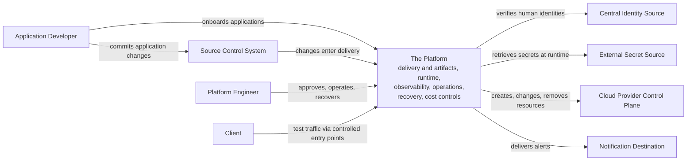

# System Context

## Purpose

The requirements baseline states what the platform must satisfy. This document establishes who is involved: the people and external systems the platform interacts with, the boundary between what the platform owns and what it depends on, and the major interactions the later architecture has to support. It deliberately stops at that boundary. How the platform is organized internally, as logical components and their relationships, is the job of the logical architecture that follows.

## Platform Boundary

The boundary is drawn by ownership, not by hosting: a capability belongs to the platform when the platform owns the behavior and the responsibility for it, even when a supporting component is hosted elsewhere. The platform's own definitions will live in the external source control system, and its delivery automation may eventually run on infrastructure the platform does not operate; both remain platform-owned. The reverse also holds: resources provisioned at the cloud provider are not outside the platform just because the provider hosts them.

Inside the boundary sit the platform's owned responsibilities: documentation and standards, environment lifecycle and configuration separation, infrastructure control, the workload runtime, controlled software delivery including build automation and artifact retention, platform networking, identity integration and privileged-access control, secret consumption, observability, operational procedures, maintenance, recovery, and cost and resource-lifecycle controls.

Outside remain the authorities and endpoints the platform depends on but does not own: the source control system, the central identity source, the external secret source, the cloud provider control plane, notification destinations, and clients.

## Actors and Responsibilities

Actors here are responsibilities, not headcount; one person may hold several at once. Delivery, reliability, and security duties that larger organizations split into separate roles sit under the Platform Engineer role in this project.

| Actor | Primary Responsibilities | Main Platform Interaction | Requirement IDs |
|---|---|---|---|
| Application Developer | Application code and application configuration intent | Onboards applications; ships changes through the delivery workflow | REQ-011, REQ-013 |
| Platform Engineer | Shared platform capabilities, standards, and lifecycle; approval of infrastructure changes and final-stage promotion; reliability, security review, and controlled operations | Approves, operates, maintains, and recovers the platform | REQ-001 to REQ-004, REQ-012, REQ-016 to REQ-019; review duties across REQ-005 to REQ-007 |
| Source Control System | Holds application source and the platform's own definitions | Every deployable change and infrastructure definition originates here | REQ-003, REQ-011 |
| Central Identity Source | Authenticates people as the central federated identity authority | Asserts the identities the platform authorizes | REQ-005 |
| External Secret Source | Holds secrets outside code, images, and repositories | Workloads retrieve secrets from it at runtime | REQ-007 |
| Cloud Provider Control Plane | External substrate and control authority for creating and operating resources | Infrastructure automation drives it to create, change, and remove resources | REQ-001 to REQ-004 |
| Notification Destination | Receives alerts so an engineer can act | Alert delivery endpoint | REQ-015 |
| Client | Sends test and validation traffic to workloads | Reaches workloads through controlled entry points | REQ-008 |

## Major Interactions

1. **Application onboarding.** A developer brings a new application onto the platform through the documented, guided path (REQ-013).
2. **Change delivery.** A source change is built and validated into a retained, traceable artifact, promoted through environments, given an explicit, recorded approval before the production-like final stage, and released progressively with a halt and rollback path (REQ-011, REQ-012, REQ-013; provenance from REQ-007).
3. **Run and adjust.** Deployed workloads receive configuration at runtime, are health-evaluated and replaced when they fail, and change capacity through the declared workflow; workloads reach their dependencies by stable name (REQ-009, REQ-010; naming from REQ-008).
4. **Human access.** People authenticate through the central identity source and act under identity-based, recorded authorization; permanent privileged access is minimized, and elevated access is explicitly granted and scoped (REQ-005; privilege from REQ-007).
5. **Workload identity and secrets.** Workloads authenticate with identities rather than long-lived static credentials where practical and supported by the selected runtime and external services, and retrieve secrets at runtime from the external secret source (REQ-006, REQ-007).
6. **Traffic in and out.** Client traffic enters only through defined, restrictable points, outbound traffic leaves the same way, and requests can be routed to a chosen workload version during release (REQ-008). Outbound connections from the platform and its workloads fall under the same egress control.
7. **Observe and alert.** Metrics, logs, and traces are collected and correlated across platform and workloads, and defined conditions raise alerts that land at the notification destination (REQ-014, REQ-015).
8. **Establish and operate.** The platform is established from documented prerequisites, rebuilt when needed, and operated through documented procedures: environment lifecycle, infrastructure change and drift correction, teardown, maintenance and upgrades, exercised recovery, and cost review with resource end-of-life (REQ-001, REQ-002, REQ-003, REQ-004, REQ-016, REQ-017, REQ-018, REQ-019).

## Ownership Boundaries

Two rules hold across every interaction above. Humans own the decisions: the actor table divides them between the Application Developer, who owns the application and its configuration intent, and the Platform Engineer role, which owns everything the platform itself is and does, including the recorded approval that gates the production-like final stage. Automation executes approved changes; it owns no engineering decision.

This is a solo-owned reference project, so the same individual may author a change and approve it. The workflow is designed to demonstrate an explicit, recorded approval control, not organizational separation of duties.

## Context Diagram

The prose above is the authoritative reading of this view; the diagram only arranges it.

## Assumptions and Open Decisions

- Container-based workloads are the approved workload boundary.
- Nothing on this list is open any more. The application, the runtime, the provider, the environment topology, and every product choice this context deferred are settled in the [decision records](decisions/), and the actor and interaction model above held without amendment as each one landed. That is the useful result: the boundary was drawn correctly before the technology was known.
- Organizational separation of duties is not demonstrated by this solo project.

## Relationship to Logical Architecture

The [Logical Architecture](logical-architecture.md) decomposes the single platform boundary shown here into eight logical responsibilities and their interactions. Every element it introduces serves one of the interactions above, and anything that served none of them would not belong. This context is its input.
